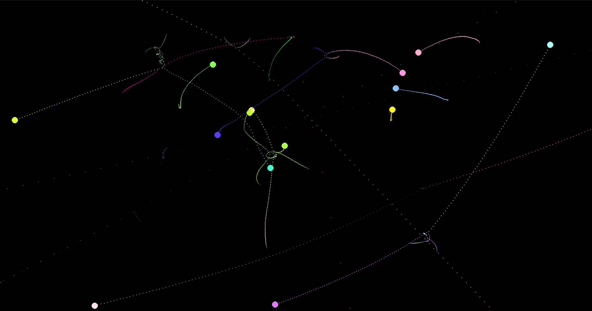

# gravity_sim
Gravity simulator in python

Customizable multi body simulator in python. Create as many bodies as you like and watch them interact!

This project is still work in progress, I still want to add a lot of fun things!

## How to run:
Clone this repo: `git clone git@github.com:KiandroDW/gravity_sim.git`
Install pygame: `pip install pygame`
Run `main.py`: `python3 main.py`

## Search for stable configurations
After doing all the previous, you can run `python3 main.py search` to search for stable configurations.
This will search for configurations which stay close for longer than 24h at 60 fps.
I will add more customisability later!

## Controls:
`C` to set the current focus to the Center of mass.
`F` to Follow the center of mass
`R` to generate a Random configuration of 2-50 equal mass bodies
`0` to return the focus to the original place.
`1-9` to select the nth body as focus if it exists. Else it leaves the focus on the last position.
`ESC` to close the program

Also check out [this project](https://github.com/BWindey/PlanetSim) made by my friend in C3!
